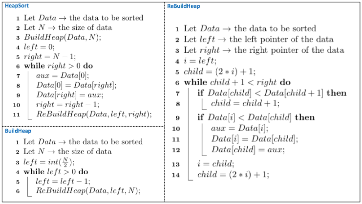

# Heap Sort: Implementação em C

 
 
 
 

 

 

Apresentado em 1964 por Robert W. Floyd e J.W.J Williams, o Heap Sort é um método da família de algoritmos de ordenação por seleção. Dentre suas vantagens, o método apresenta bom desempenho em conjuntos aleatórios de dados, bem como, consumo moderado de memória. Além disso, o desempenho de seu pior caso é praticamente o mesmo de seu caso médio, o que faz com que sua aplicação seja uma boa opção para entradas grandes de dados.

Em literatura, há diferentes maneiras de se implementar o Heap Sort, as mais comums utilizam listas de prioridade (LP) e/ou heaps para representar sua estrutura interna. As listas de prioridade são comuns em Sistemas Operacionais e apresentam, dentre suas funções, a capacidade de mapear o tempo de execução de processos, rastrear páginas em memória a serem substituídas e gerenciar processos. Como Heap, assumem funções generalistas e podem ser aplicadas nos mais diversos problemas que envolvam ordenação. Vejamos a seguir os custos envolvidos com ambas as estruturas de apoio. 

| Custo           |  LP Ordenada            | LP não Ordenada         | Heap                    |
|:----------------|:-----------------------:|:-----------------------:|:-----------------------:|
| Construção      ||||
| Inserção        ||||
| Remoção         |||| 
| União (ponteiro)||||
| União (vetor)   ||||

Embora a lista por prioridade apresente resultados melhores, sua estrutura é limitada o que faz do Heap a melhor opção dentre as três. Nesse contexto, há estudos que podem melhorar o desempenho do método quando estruturado sob um heap. por exemplo, utilizando como estrutura de apoio árvores binomiais [vide teoria](https://pt.wikipedia.org/wiki/Heap_binomial).  

Como pode ser observado, métodos de ordenação por heaps tendem a utilizar estruturas abstratas de dados (i.e., TADs) cujas ações o permitem definir uma hierarquia em árvore dos elementos armazenados. Nessa hierarquia cada elemento do conjunto de entrada pode ser considerado um nó pai ou filho. Um modelo por animação dessa estrutura pode ser observada abaixo.

	 

 

> Considerando a animação acima apresentada e dado um conjunto de elementos <b><e1, e2, . . . , en></b> tem-se que:
>
> - Os elementos filhos de um nó pai cuja a posição é i estarão armazenados nas posições 2i e 2i+1 do vetor e esses serão menores em valor do que o pai se estivermos tratando de um Max Heap ou o pai será o menor valor dentre eles se estivermos tratando de um Min Heap.
>
> - O elemento posicionado na primeira posição do Heap é chamado de elemento raiz e é sempre o maior elemento do conjunto.  

Uma vez estabelecida as regras do Heap Sort,  podemos definir o método propriamente dito a partir de três funções, uma para construir o Heap (i.e., BuildHeap), uma função para reconstruir o heap a cada movimentação (i.e., ReBuildHeap) e uma função principal, a própria HeapSort. A seguir tem-se o pseudo algoritmo representativo para essas funções.

	 

 

A execução inicia chamando a função HeapSort, passando o conjunto de elementos e o tamanho do vetor. Note que a primeira linha da função chama o construtor do Heap, a função BuildHeap. Nela, o valor de N é dividido por dois para encontrar o último nó pai valido do conjunto. Feito isso, o pai vai retrocedendo até chegar à raiz ou cabeça do vetor. A cada interação da função ReBuildHeap o conjunto de elementos é passado e junto a esse um ponteiro para o pai (representado no ReBuildHeap por left) e um para o fim do conjunto N (representado no ReBuildHeap por right). Em ReBuildHeap, a regra de manter todos os nós pai maiores ou menores que seus filhos é revisada e, caso necessário, movimentações no heap são feitas para reestabelecer a estrutura correta Min ou Max Heap.

> <b>Vantagens:</b> 
> 
> - Seu custo, o qual se mantem em  para qualquer que seja o conjunto de entrada. Além disso, por não utilizar nenhuma recursão não há necessidade da utilização de memória extra para a execução, o que se torna um ponto positovo do método. 

> <b>Desvantagens:</b> 
>
> - A sequência de execução do método é uma das mais complexas dentre os algoritmos de custo , mesmo quando comparado com métodos como o QuickSort. Além disso, trata-se de um método não estável, o que pode introduzir custo adicional de movimentação quando há elementos repetidos no conjunto.

# Compilação e Execução

O método Heap Sort disponibilizado possui um arquivo Makefile que realiza todo o procedimento de compilação e execução. Para tanto, temos as seguintes diretrizes de execução:

| Comando                |  Função                                                                                           |
| -----------------------| ------------------------------------------------------------------------------------------------- |
|  `make clean`          | Apaga a última compilação realizada contida na pasta build                                        |
|  `make`                | Executa a compilação do programa utilizando o gcc, e o resultado vai para a pasta build           |
|  `make run`            | Executa o programa da pasta build após a realização da compilação                                 |

# Contatos

<a style="color:black" href="mailto:michel@cefetmg.br?subject=[GitHub]%20Source%20Dynamic%20Lists">
✉️ <i>michel@cefetmg.br</i>
</a>